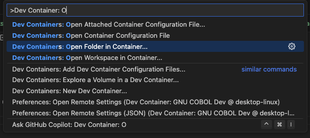

# InCollege COBOL Project

## What it supports currently

- Input in `data/incollege-input.txt` making sure `data/incollege-output.txt` and `data/accounts.dat` exist
- It will create upto 5 users with password policy enforcement of >8 and <=12 chars, 1 digit, speacial and UPPER req


## Run

> Ensure you have docker
> Clone this repo
> Open the folder of this repo in VS Code
> Press `cmd + shift + P`
> 
> Choose the option as shown in screenshot


> Initially try `cmd + shift + P`
> It should build and automatically get Inputs from data/\*-input.txt and log output in data/\*-output.txt

## For Testers

- Create a branch `feature/test-IO` or something with understandable name from this branch
- Go to `src/IO.cob`, you will see lines:
```
           SELECT INPUT-FILE ASSIGN TO "data/InCollege-Input.txt"
               ORGANIZATION IS LINE SEQUENTIAL.
           SELECT OUTPUT-FILE ASSIGN TO "data/InCollege-Output.txt"
               ORGANIZATION IS LINE SEQUENTIAL.
```
- Here update `data/*` files to `tests/test1-input.txt` and so on also `tests/test1-output.txt`
- Test all edge cases for account management


